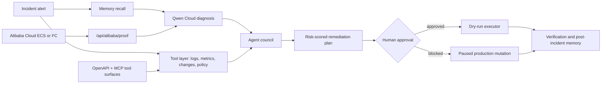

# AegisOps Architecture

## Runtime Components

- `src/server/agent/orchestrator.ts` coordinates the full autopilot workflow.
- `src/server/agent/qwenClient.ts` calls Qwen Cloud through an OpenAI-compatible chat-completions endpoint and falls back to deterministic fixtures when no key is present.
- `src/server/agent/memory.ts` stores persistent lessons and retrieves them with recency, priority, and lexical relevance.
- `src/server/agent/tools.ts` provides external-tool simulations for logs, metrics, change graph, policy checks, and dry-run remediation.
- `src/server/agent/toolRegistry.ts` exposes those capabilities as incident-scoped custom tools.
- `src/server/mcp/aegisopsMcp.ts` provides a lightweight MCP stdio tool server.
- `src/server/cloud/alibabaProof.ts` exposes Alibaba Cloud/Qwen deployment evidence without returning secrets.
- `src/client/main.tsx` renders the judge-facing dashboard.
- `agents/aegisops/openapi.yaml` and `agents/aegisops/cap-manifest.json` document the Qwen tool surface.

## Track Fit

The primary submission track is Track 4: Autopilot Agent.

The app automates a real workflow end to end: intake, diagnosis, evidence gathering, planning, approval, safe execution, verification, and learning. It also includes Track 3-style agent roles and Track 1-style persistent memory as technical differentiators.
